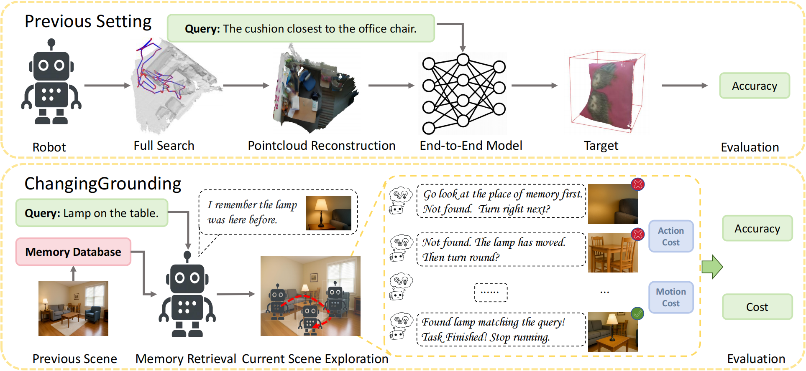

# ChangingGrounding: 3D Visual Grounding in Changing Scenes

  <!-- <b>Authors</b>  -->
  <a href="https://github.com/hm123450" target="_blank">Miao Hu1</a>,
  <a href="https://github.com/huang583824382" target="_blank">Zhiwei Huang2</a>,
  <a href="https://tai-wang.github.io" target="_blank">Tai Wang4</a>,
  <a href="https://oceanpang.github.io" target="_blank">Jiangmiao Pang4</a>,
  <a href="http://dahua.site" target="_blank">Dahua Lin3,4</a>,
  <a href="http://www.aiar.xjtu.edu.cn/info/1046/1229.htm" target="_blank">Nanning Zheng1*</a>,
  <a href="https://runsenxu.com" target="_blank">Runsen Xu3,4*</a>

  1Xi’an Jiaotong University,
  2Zhejiang University,
  3The Chinese University of Hong Kong,
  4Shanghai AI Laboratory

  *Corresponding Author

<!-- <a href="">📑 Paper</a>  |
  <a href="">📖 arXiv</a> -->

  <a href="https://hm123450.github.io/CGB/">🌐 Homepage</a>

## 🔔News
🔥[2025-10-17]: We released our paper. The code and benchmark will be released after the paper is accepted.

## Abstract
Real-world robots localize objects from natural-language instructions while scenes around them keep changing. Yet most of the existing 3D visual grounding (3DVG) method still assumes a reconstructed and up-to-date point cloud, an assumption that forces costly re-scans and hinders deployment. We argue that 3DVG should be formulated as an active, memory-driven problem, and we introduce ChangingGrounding, the first benchmark that explicitly measures how well an agent can exploit past observations, explore only where needed, and still deliver precise 3D boxes in changing scenes. To set a strong reference point, we also propose Mem-ChangingGrounder, a zero-shot method for this task that marries cross-modal retrieval with lightweight multi-view fusion: it identifies the object type implied by the query, retrieves relevant memories to guide actions, then explores the target efficiently in the scene, falls back when previous operations are invalid, performs multi-view scanning of the target, and projects the fused evidence from multi-view scans to get accurate object bounding boxes. We evaluate different baselines on ChangingGrounding, and our Mem-ChangingGrounder achieves the highest localization accuracy while greatly reducing exploration cost. We hope this benchmark and method catalyze a shift toward practical, memory-centric 3DVG research for real-world applications.

## 📄 License

Shield: [![CC BY-NC 4.0][cc-by-nc-shield]][cc-by-nc]

This work is licensed under a
[Creative Commons Attribution-NonCommercial 4.0 International License][cc-by-nc].

[![CC BY-NC 4.0][cc-by-nc-image]][cc-by-nc]

[cc-by-nc]: https://creativecommons.org/licenses/by-nc/4.0/
[cc-by-nc-image]: https://licensebuttons.net/l/by-nc/4.0/88x31.png
[cc-by-nc-shield]: https://img.shields.io/badge/License-CC%20BY--NC%204.0-lightgrey.svg

## Acknowledgment
The ChangingGrounding dataset builds upon [3RScan](https://waldjohannau.github.io/RIO/) and [ReferIt3D](https://github.com/referit3d/referit3d). Our method implementation is adapted from [VLM-Grounder](https://github.com/InternRobotics/VLM-Grounder). We thank these teams for their open-source contributions.

## Contact
- Miao Hu: 2464882060@stu.xjtu.edu.cn
- Runsen Xu:  runsxu@gmail.com
